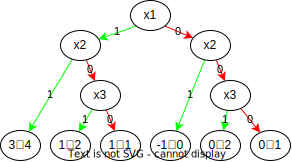

# Počítání spojení víceterminálových BDD
##### Matouš Mařík
    Show an algorithm for computing 𝑓 ⊙ 𝑔 where 𝑓 and 𝑔 are multiterminal BDDs, and ⊙ is some arithmetic binary operation. Compute with your algorithm the MTBDD of 𝑓 ⊙ 𝑔, where
$$
    𝑓 = \begin{cases}
    2𝑥2 + 1 & 𝑥1 = 1 \\
    −𝑥2 & 𝑥1 = 0 \\
    \end{cases}
$$
$$
    𝑔 = \begin{cases}
    4𝑥1 & 𝑥2 = 1 \\
    𝑥3 + 1 & 𝑥2 = 0 \\
    \end{cases}
$$
    Assuming the variable order 𝑥1, 𝑥2, 𝑥3

## Řešení
Algoritmus bude induktivní konstrukce OBDD s restrikcí proměnných podle výsledků kombinací funkčních a OBDD reprezentací jednotlivých MTBDD: $B^f$ a $B^g$:
$$B^f \odot B^g = (-x + 1)(B^f|_{x=0} \odot B^g|_{x=0}) + (x)(B^f|_{x=1} \odot B^g|_{x=1})$$
kde $x$ je minimální proměnná, podle které nebyla provedena restrikce.

Výsledný výpočet pro $f \odot g$ bude:
$$
(-x_1 + 1)(-x_2 \odot g) + x_1(2x_2 + 1 \odot g) =
$$
$$
= (-x_1 + 1)((-x_2 + 1)(-0 \odot x_3 + 1) + x_2(-1 \odot 0)) + x_1((-x_2 + 1)(1 \odot x_3 + 1) + x_2(3 \odot 4)) =
$$
$$
= (-x_1 + 1)((-x_2 + 1)((-x_3 + 1)(0 \odot 1) + x_3(0 \odot 2)) + x_2(-1 \odot 0)) + x_1((-x_2 + 1)((-x_3 + 1)(1 \odot 1) + x_3(1 \odot 2)) + x_2(3 \odot 4))
$$

## Výsledný MTBDD

