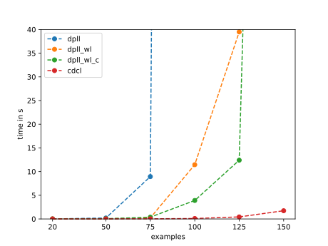

# Report on created SAT solvers performance

## Examples
As examples, uniform random 3-SAT formulas from [SATLIB Benchmark Problems](https://www.cs.ubc.ca/~hoos/SATLIB/benchm.html) were used.

## Different SAT solvers comparison
There were 4 solvers created for this task:  
1. DPLL solver with adjacency lists
2. DPLL with watched literals
3. DPLL with watched literals and cache
4. CDCL with heuristic

In a certain sense, later solvers are extensions of the former. First two solvers are selecting next decision literal in given order from unassigned set (that order is given by python's set implementation) and always tries first the positive one and then the negative.

Cached DPLL select literals by number of their previous assignments and CDCL solver uses VSIDS heuristic.

### Results 
Table show average of statistics for first few examples from selected categories. Examples shows number of variables, `-` is for unsatisfiable.
</table><table border="1" class="dataframe">
  <thead>
    <tr>
      <th>examples</th>
      <th colspan="3" halign="left">dpll</th>
      <th colspan="3" halign="left">dpll_wl</th>
      <th colspan="3" halign="left">dpll_wl_c</th>
      <th colspan="3" halign="left">cdcl</th>
    </tr>
    <tr>
      <th></th>
      <th>time in s</th>
      <th>decisions</th>
      <th>unit propagation steps</th>
      <th>time in s</th>
      <th>decisions</th>
      <th>unit propagation steps</th>
      <th>time in s</th>
      <th>decisions</th>
      <th>unit propagation steps</th>
      <th>time in s</th>
      <th>decisions</th>
      <th>unit propagation steps</th>
    </tr>
  </thead>
  <tbody>
    <tr>
      <td>20</td>
      <td>0.001061</td>
      <td>205.8</td>
      <td>384.9</td>
      <td>0.001006</td>
      <td>27.40</td>
      <td>112.45</td>
      <td>0.001667</td>
      <td>23.95</td>
      <td>94.25</td>
      <td>0.001598</td>
      <td>11.3</td>
      <td>63.85</td>
    </tr>
    <tr>
      <td>50</td>
      <td>0.198042</td>
      <td>35561.3</td>
      <td>73593.7</td>
      <td>0.026515</td>
      <td>548.15</td>
      <td>3765.10</td>
      <td>0.044791</td>
      <td>470.15</td>
      <td>3234.45</td>
      <td>0.007851</td>
      <td>53.1</td>
      <td>593.95</td>
    </tr>
    <tr>
      <td>-50</td>
      <td>0.501521</td>
      <td>87284.6</td>
      <td>188687.8</td>
      <td>0.075927</td>
      <td>1353.60</td>
      <td>9218.60</td>
      <td>0.116926</td>
      <td>982.70</td>
      <td>6863.65</td>
      <td>0.000665</td>
      <td>85.6</td>
      <td>1149.95</td>
    </tr>
    <tr>
      <td>75</td>
      <td>8.943115</td>
      <td>1648366.6</td>
      <td>3560158.0</td>
      <td>0.229028</td>
      <td>3787.80</td>
      <td>32269.20</td>
      <td>0.376290</td>
      <td>3573.70</td>
      <td>31846.60</td>
      <td>0.029397</td>
      <td>149.9</td>
      <td>2279.10</td>
    </tr>
    <tr>
      <td>-75</td>
      <td>18.468739</td>
      <td>3138016.8</td>
      <td>6929586.7</td>
      <td>0.687360</td>
      <td>11359.40</td>
      <td>94041.70</td>
      <td>0.849832</td>
      <td>9686.00</td>
      <td>83231.50</td>
      <td>0.003376</td>
      <td>331.3</td>
      <td>5329.50</td>
    </tr>
    <tr>
      <td>100</td>
      <td>1227.542824</td>
      <td>218680711.8</td>
      <td>458155089.8</td>
      <td>11.454444</td>
      <td>171531.40</td>
      <td>1680165.00</td>
      <td>3.898769</td>
      <td>50146.20</td>
      <td>516091.80</td>
      <td>0.090529</td>
      <td>419.6</td>
      <td>7835.80</td>
    </tr>
    <tr>
      <td>125</td>
      <td>NaN</td>
      <td>NaN</td>
      <td>NaN</td>
      <td>39.494395</td>
      <td>502875.20</td>
      <td>5621040.20</td>
      <td>12.403483</td>
      <td>144754.80</td>
      <td>1654406.60</td>
      <td>0.428352</td>
      <td>1483.2</td>
      <td>31744.80</td>
    </tr>
    <tr>
      <td>150</td>
      <td>NaN</td>
      <td>NaN</td>
      <td>NaN</td>
      <td>NaN</td>
      <td>NaN</td>
      <td>NaN</td>
      <td>341.849246</td>
      <td>3463772.40</td>
      <td>44671552.00</td>
      <td>1.732476</td>
      <td>3991.6</td>
      <td>102263.80</td>
    </tr>
  </tbody>
</table>

## CDCL

### LBD and conflicts
To obtain best values, some kind of gridsearch has to be made. 
- LBD values: `1, 2, 3, 4`
- conflict limit: `32, 64, 128, 256`
- heuristics: `VSIDS, most unsatisfied literal` (see [CDCL heuristics](#cdcl-heursitics))

In table cells are best 3 parameters combination by average times from 5 examples with specified number of variables:  
| Examples | VSIDS | Most Unsat Lit |
| --- | --- | --- |
| 75 | (3, 32), (2, 32), (1, 64) | (3, 128), (2, 64), (2, 32) |
| 100 | (4, 32), (1, 128), (4, 64) | (4, 128), (4, 64), (3, 64) |
| 125 | (3, 64), (1, 64), (4, 32) | (3, 256), (2, 128), (2, 64) |
| 150 | (1, 64), (3, 256), (1, 32) | (3, 256), (4, 256), (2, 128) |

Results were kind of silent, probably for small number of examples for averaging (5).

From the results it seems that:
1. selected LBD value is 3, it is just an average
2. conflict limit seems to be proportional to number of variables
   - for `VSIDS` heuristics it is `32` for smaller examples (max 100 variables) and `64` for larger
   - for `most unsatisfied literal` it seems to be simmilar but for higher values - `128` and `256`

### CDCL heursitics
For 15 satisfiable examples with 125 and 150 variables 3 heuristics were tried: 
- `random` with conflict_limit=128
- `most unsatisfied literal` with conflict_limit=256
  - select unassigned literal from most unsatisfied clauses
- `VSIDS` with conflict_limit=64
  - gives weight to recent conflict and decay all weights over time

|     125 variables   |      time |   decisions |   unit propagation steps |   restarts |
|:------------|----------:|------------:|-------------------------:|-----------:|
| unsatisfied |  0.16796  |      394.6  |                  7120.13 |    0.6     |
| random      | 17.3871   |    11865.7  |                215868    |   11.4667  |
| vsids       |  0.465268 |     1259.73 |                 26746.4  |    6.13333 |

| 150 variables      |      time |   decisions |   unit propagation steps |   restarts |
|:------------|----------:|------------:|-------------------------:|-----------:|
| unsatisfied |   1.9673  |     2060.73 |                  47073.5 |    2.13333 |
| random      | 237.603   |    40795.3  |                 833434   |   15.2667  |
| vsids       |   1.62729 |     3018    |                  76594   |    8.86667 |

The results are pretty silent again, there is average 0.6 restarts for the *unsatisfied* heuristic, that is kind of lucky. That is why it has even better time than *VSIDS* with 125 variables.

It is clear that *VSIDS* has much more restarts and decisions than *unsatisfied* and still has a better performance.

## Conclusion
Since python is not really suitable for performance testing and because of bad luck with example selection, there were no convincing results, but it is clear that hyperparameters such as heuristics, conflict_limit and lbd have key role in the perfomance and that each upgrade of the solver is improving its perfomance.

